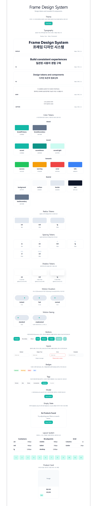
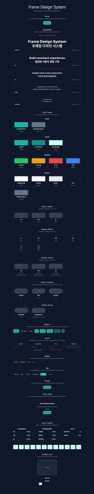
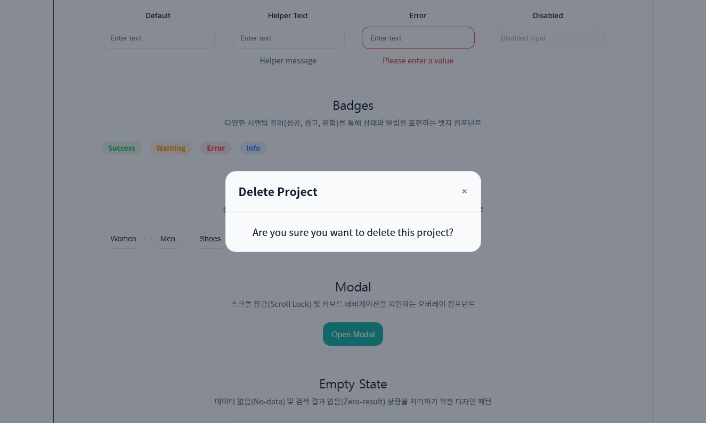

# Frame Design System

컬러, 타이포그래피, 간격과 상태 기준을 디자인 토큰으로 구조화하고,
일관된 컴포넌트와 Light/Dark Theme으로 확장한 디자인 시스템 프로젝트

개별 화면을 반복해서 스타일링하는 방식에서 벗어나,
시각적 기준을 토큰으로 정의하고 공통 UI와 테마에 적용한 뒤
브라우저 화면에서 결과를 검수·조정했습니다.

## Project Links

- [Live Demo](https://frame-design-system.vercel.app)
- [View Case Study](./docs/case-study.md)
- [SLI Scientific Application](https://platform-redesign-five.vercel.app)

---

## Preview

### Light Mode



### Dark Mode



### Modal



---

## Project Overview

Frame Design System은 컬러, 타이포그래피, 간격, 레이아웃과 모션을
디자인 토큰으로 구조화하고, 이를 공통 UI와 Light/Dark Theme에
일관되게 적용하기 위해 제작한 개인 포트폴리오 프로젝트입니다.

개별 화면을 만드는 데 그치지 않고,
여러 화면에서 동일한 시각적 규칙과 인터랙션 기준을 유지할 수 있도록
토큰, 컴포넌트 상태와 사용 원칙을 정리하는 데 집중했습니다.

React 기반 구현 환경은 AI 도구를 활용해 구성했으며,
설계한 토큰과 UI 기준이 실제 브라우저 화면에서 의도대로 표현되는지
반복적으로 검수·수정했습니다.

## Why This Project

Minimal Ecommerce를 구성하는 과정에서
버튼, 카드, 간격과 상태 표현이 여러 화면에서 반복되고,
화면마다 기준을 다르게 적용하면 UI의 일관성을 유지하기 어렵다는 점을 확인했습니다.

이를 계기로 개별 화면 중심의 작업에서 확장해,
컬러, 타이포그래피, 간격과 상태를 공통 기준으로 정의하고
여러 UI에 재사용할 수 있는 디자인 시스템 구조를 설계했습니다.

```text
반응형 UI 구성
        ↓
반복되는 시각·상태 기준 발견
        ↓
디자인 토큰과 컴포넌트 기준 체계화
```

---

## Design System Structure

Frame Design System은 시각적 기준에서 시작해 
실제 UI 패턴으로 확장되는 구조로 설계했습니다.

```text
Design Foundations
        ↓
Design Tokens
        ↓
Components
        ↓
Patterns
        ↓
Theme Application
```

### Design Foundations

UI 전반에서 반복되는 시각적 기준을 먼저 정의했습니다.

- Color
- Typography
- Spacing
- Radius
- Shadow
- Layout
- Motion

각 기준을 개별 화면의 스타일 값으로 직접 작성하지 않고,
여러 컴포넌트에서 공유할 수 있는 토큰 구조로 정리했습니다.

### Design Tokens

디자인 토큰은 시각적 값을 목적에 따라 구분해 관리했습니다.

- Primitive Tokens : 원시 색상과 기본 수치

- Semantic Tokens : 텍스트, 배경, 보더와 상태의 역할

- Component Tokens : 버튼, 입력 요소와 카드에 적용되는 값

예를 들어 특정 색상 값을 컴포넌트에 직접 사용하는 대신,
primary, surface, text, border와 같은 의미 기반 토큰을 사용해 
테마가 변경되어도 UI의 역할이 유지되도록 구성했습니다.

### Components

토큰을 기반으로 반복되는 UI 요소의 공통 구조와
크기, 변형, 상태 기준을 정의하고 실제 화면에 적용했습니다.

- Button
- Input
- Select
- Badge
- Card
- Modal
- Tag
- Motion

각 UI는 크기, 상태와 사용 목적에 따라
일관된 변형 기준을 사용할 수 있도록 정리했습니다.

### Component States

컴포넌트의 사용 맥락에 따라 다음 상태 기준을 정의했습니다.

- Default
- Hover
- Focus
- Active
- Selected
- Disabled
- Error

이를 통해 화면마다 상태 표현이 달라지지 않고, 동일한 상호작용 규칙을 유지할 수 있도록 했습니다.

### Patterns

개별 컴포넌트를 조합해 실제 화면에서 반복적으로 사용되는 UI 패턴으로 확장했습니다.

- Form Field
- Search Interface
- Filter Group
- Card Group
- Modal Action
- Empty State

개별 컴포넌트의 정의에 그치지 않고,
실제 화면에서 함께 사용되는 구성과 인터랙션 패턴까지 확장했습니다.

---

## Design-to-UI

Frame Design System에서는 Figma에서 정의한 시각 기준이
브라우저 화면에서도 같은 의미와 구조로 적용되는지 확인하는 데 집중했습니다.

토큰 이름, 컴포넌트 상태와 테마 기준을 일관되게 유지하고,
디자인 결과와 실제 UI 사이의 차이를 검수·조정했습니다.

```text
Figma Foundation
        ↓
Design Token
        ↓
CSS Custom Property
        ↓
React-based UI
        ↓
UI Pattern
```

### Token Application

컬러, 간격, 타이포그래피와 기타 시각 기준은
CSS 사용자 정의 속성으로 적용되었습니다.

```css
:root {
  --color-primary: ...;
  --color-surface: ...;
  --color-text-primary: ...;
  --space-4: ...;
  --radius-medium: ...;
  --shadow-card: ...;
}
```
반복되는 시각 값을 개별 UI마다 따로 지정하지 않고
공통 토큰을 참조하는 구조로 정리했으며,
브라우저 화면에서 색상, 간격과 상태 표현이 일관되게 적용되는지 확인했습니다.

### Semantic Naming

토큰 이름은 단순한 색상이나 수치보다 UI에서 수행하는 역할을 기준으로 정의했습니다.

blue-600
→ 원시 값

color-primary
→ 주요 행동 색상

color-surface
→ 콘텐츠 배경

color-text-muted
→ 보조 텍스트

이 방식은 시각 스타일이 변경돼도 컴포넌트의 의미와 사용 목적을 유지할 수 있도록 합니다.

### Component Variants

버튼을 화면마다 다른 기준으로 만들지 않고,
사용 목적, 크기와 상태에 따라 일관된 변형 기준을 사용할 수 있도록 정리했습니다.

```jsx
<Button variant="primary" size="medium">
  Confirm
</Button>

<Button variant="secondary" size="medium">
  Cancel
</Button>
```
위 코드는 구현 환경에서 적용된 예시이며,
디자인 관점에서는 Primary와 Secondary의 위계,
크기별 간격과 상태 표현이 일관되게 유지되는지를 중심으로 검수했습니다.

### Theme Application

동일한 UI 구조를 유지하면서
의미 기반 토큰 값이 Light와 Dark Theme에 맞게 전환되도록 구성했습니다.

```text
UI Structure
        +
Semantic Tokens
        ↓
Light Theme / Dark Theme
```

주요 테마 토큰은 다음과 같습니다.

- color-background
- color-surface
- color-text-primary
- color-text-secondary
- color-border
- color-primary
- color-focus

각 토큰은 특정 색상값보다 UI에서 수행하는 역할을 기준으로 정의했습니다.

이를 통해 테마가 변경되어도
버튼, 입력 요소, 카드와 모달의 정보 위계와 사용 목적이 유지되는지
브라우저 화면에서 비교·검수했습니다.

화면별로 색상을 다시 정의하지 않고도
같은 의미와 위계를 유지할 수 있는 기준을 정리했습니다.

### Documentation

각 UI는 사용 목적과 상태 기준을 확인할 수 있도록 다음 내용을 정리했습니다.

- Purpose
- Variants
- Sizes
- States
- Usage Example
- Interaction

문서화의 목적은 컴포넌트 목록을 나열하는 것이 아니라,
디자이너와 개발자가 같은 기준으로 UI를 이해하고 검토할 수 있도록 하는 것이었습니다.

- [Case Study](./docs/case-study.md)

---

## Application to SLI Scientific

Frame Design System에서 정리한 토큰과 컴포넌트 원칙 일부를
다음 프로젝트인 SLI Scientific의 UI Foundation에 적용했습니다.

Frame의 구조를 그대로 복제하기보다,
B2B 연구장비 플랫폼의 정보 밀도와 전문적인 브랜드 맥락에 맞게
컬러, 타이포그래피, 간격과 컴포넌트 기준을 조정했습니다.

### Applied Principles

| Frame Design System | SLI Scientific |
|---|---|
| Semantic color tokens | Deep Blue, Slate, Muted Cyan 기반 컬러 체계 |
| Typography scale | 제품명, 섹션 제목, 설명과 사양 정보의 계층 |
| Spacing rules | 페이지 섹션과 콘텐츠 그룹의 공통 간격 |
| Button variants | 주요 행동, 보조 행동과 텍스트 링크 구분 |
| Card principles | Product, Resource, Support 카드에 적용 |
| Layout rules | 공통 컨테이너와 페이지 정렬 기준 |
| Responsive rules | Desktop, Tablet, Mobile 레이아웃 전환 |
| Component states | Hover, Focus, Selected, Disabled 상태 표현 |

### Contextual Extension

SLI Scientific의 사용 맥락에 맞춰 다음 부분을 확장했습니다.

- 긴 제품명과 모델명을 수용하는 카드 구조
- 기술 사양과 문서를 위한 높은 정보 밀도
- 제품 이미지와 텍스트 정보의 균형
- 모델 선택과 문의 흐름
- 모바일 환경에서의 제품 상세 재배치
- B2B 서비스에 맞는 차분한 시각 체계

이를 통해 디자인 토큰과 컴포넌트 원칙이
서로 다른 서비스 맥락에서 어떻게 조정되고 재사용될 수 있는지 확인했습니다.

- [Live SLI Scientific](https://platform-redesign-five.vercel.app)

---
